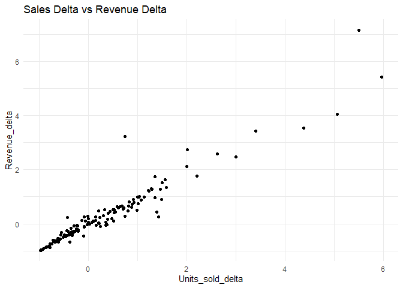

Abhijith R Upadhya
2025-09-07

# **Retail Store Inventory Analysis**

<figure>

<figcaption aria-hidden="true">Source: Inventory Analysis.</figcaption>
</figure>

## Loading the dataset

### Descriptive Statistics

Data Summary: Descriptive statistics for Units_sold, Price, and Revenue
give an overview of central tendencies and variability. This basic step
is essential to understand the spread and range of key metrics.

``` r
# Read the CSV file
data <- read_csv("retail_store.csv")

# Convert 'Date' column to Date and extract the 'Year'
data$Date <- as.Date(data$Date)
data$Year <- year(data$Date)
#data$Year
# Add 'Revenue' column
data$Revenue <- data$Units_sold * data$Price
# Filter out rows where 'Price' and 'Units_sold' are not 0
df <- data %>% filter(Price != 0, Units_sold != 0)

# Data info
str(data)
```

    ## spc_tbl_ [937 × 6] (S3: spec_tbl_df/tbl_df/tbl/data.frame)
    ##  $ Date      : Date[1:937], format: "2014-01-01" "2014-01-02" ...
    ##  $ Units_sold: num [1:937] 0 70 59 93 96 145 179 321 125 88 ...
    ##  $ Stock     : num [1:937] 4972 4902 4843 4750 4654 ...
    ##  $ Price     : num [1:937] 1.29 1.29 1.29 1.29 1.29 1.29 1.29 1.29 1.09 1.09 ...
    ##  $ Year      : num [1:937] 2014 2014 2014 2014 2014 ...
    ##  $ Revenue   : num [1:937] 0 90.3 76.1 120 123.8 ...
    ##  - attr(*, "spec")=
    ##   .. cols(
    ##   ..   Date = col_date(format = ""),
    ##   ..   Units_sold = col_double(),
    ##   ..   Stock = col_double(),
    ##   ..   Price = col_double()
    ##   .. )
    ##  - attr(*, "problems")=<externalptr>

``` r
options(repr.plot.width = 10, repr.plot.height = 4)
# Descriptive statistics for 'Units_sold', 'Price', and 'Revenue'
summary(data[, c("Units_sold", "Price", "Revenue")])
```

    ##    Units_sold         Price          Revenue      
    ##  Min.   :  0.00   Min.   :0.000   Min.   :  0.00  
    ##  1st Qu.: 33.00   1st Qu.:1.290   1st Qu.: 52.32  
    ##  Median : 76.00   Median :1.390   Median :112.23  
    ##  Mean   : 90.53   Mean   :1.593   Mean   :148.23  
    ##  3rd Qu.:127.00   3rd Qu.:1.890   3rd Qu.:207.10  
    ##  Max.   :542.00   Max.   :2.980   Max.   :870.24

## Visualizations and Analysis

### Time Series Analysis

Price Over Time: A line plot shows how the Price of products changes
over time. Any trends, seasonal patterns, or sudden price spikes or
drops are easily visible here.

``` r
# Visualization - Price over time
ggplot(df, aes(x = Date, y = Price)) +
    geom_line() +
    ggtitle("Price over time") +
    theme_minimal() 
```

<!-- -->

Sales in Units Over Time: A line plot of Units_sold over time shows
fluctuations in demand, helping identify peak sales periods and slower
months.

``` r
# Visualization - Sales in Units over time
ggplot(df, aes(x = Date, y = Units_sold)) +
  geom_line() +
  ggtitle("Sales in Units") +
  theme_minimal()
```

<!-- -->

Sales Revenue Over Time: Revenue over time helps to pinpoint
high-revenue periods and indicates possible trends in sales volume
combined with pricing.

``` r
# Visualization - Sales Revenues over time
ggplot(df, aes(x = Date, y = Revenue)) +
  geom_line() +
  ggtitle("Sales Revenues") +
  theme_minimal()
```

<!-- -->

### Density Analysis

Density Plots: Price, Stock, Units_sold, and Revenue densities give
insights into the distributions of these metrics. For example, if Price
density is skewed right, it implies most prices are on the lower end,
with a few higher-priced outliers.

``` r
# Density Plots
ggplot(df, aes(x = Price)) +
  geom_density() +
  ggtitle("Price Density") +
  theme_minimal()
```

<!-- -->

``` r
ggplot(df, aes(x = Stock)) +
  geom_density() +
  ggtitle("Stock Density") +
  theme_minimal()
```

<!-- -->

``` r
ggplot(df, aes(x = Units_sold)) +
  geom_density() +
  ggtitle("Sales Density") +
  theme_minimal()
```

<!-- -->

``` r
ggplot(df, aes(x = Revenue)) +
  geom_density() +
  ggtitle("Revenues Density") +
  theme_minimal()
```

<!-- -->

### Sales and Revenue by Year

Scatter Plot - Revenue vs. Sales by Year: This plot shows how revenues
correspond to unit sales, color-coded by year, revealing relationships
between these metrics. The scatter pattern can indicate if certain years
experienced higher variability or concentration.

``` r
ggplot(df, aes(x = Units_sold, y = Revenue, color = as.factor(Year))) +
  geom_point() +
  ggtitle("Revenues vs Sales by Year") +
  theme_minimal()
```

<!-- -->

``` r
ggplot(df, aes(x = Units_sold, y = Revenue, color = as.factor(Year))) +
  geom_smooth(method = "lm") +
  ggtitle("Revenues vs Sales by Year") +
  theme_minimal()
```

<!-- -->

Boxplot - Sales Variability by Year: This boxplot shows sales spread
across different years, illustrating any significant year-to-year
variability in sales volume.

``` r
# Boxplot - Sales variability compared by year
ggplot(df, aes(x = as.factor(Year), y = Units_sold)) +
  geom_boxplot() +
  ggtitle("Sales Variability by Year") +
  theme_minimal()
```

<!-- -->

KDE Plot - Sales Variability by Year: KDEs further reveal year-based
sales trends, highlighting periods of higher or lower sales density.

``` r
# KDE Plot - Sales variability compared by year
ggplot(df, aes(x = Units_sold, color = as.factor(Year))) +
  geom_density() +
  ggtitle("Sales Variability by Year") +
  theme_minimal()
```

<!-- -->

Sales vs Price: A scatter plot with a linear model (regression)
visualizes the relationship between price and units sold, potentially
revealing elasticity (sensitivity to price changes) by year.

``` r
# Analyzing Sales Variability by Price
ggplot(df, aes(x = Price, y = Units_sold, color = as.factor(Year))) +
  geom_smooth(method = "lm") +
  ggtitle("Sales Variability by Price") +
  theme_minimal()
```

<!-- -->

### Stock Analysis

Stock Analysis Over Time: Tracking stock over time helps assess if there
are predictable cycles in stock replenishment and consumption.

``` r
# Stock Analysis over Time
ggplot(df, aes(x = Date, y = Stock)) +
  geom_line() +
  ggtitle("Stock Analysis Over Time") +
  theme_minimal()
```

<!-- -->

Stock Density by Year: Density plots of stock can highlight if there are
periods with higher or lower stock, possibly indicating seasonal
inventory management.

``` r
# Stock Density by Year
ggplot(df, aes(x = Stock, color = as.factor(Year))) +
  geom_density() +
  ggtitle("Stock Density by Year") +
  theme_minimal()
```

<!-- -->

Sales vs Stock by Year: This regression model on sales vs. stock shows
if stock levels impact sales, which may reflect supply limitations or
overstocking.

``` r
# Linear Model - Sales vs Stock by year
ggplot(df, aes(x = Units_sold, y = Stock, color = as.factor(Year))) +
  geom_smooth(method = "lm") +
  ggtitle("Sales vs Stock by Year") +
  theme_minimal()
```

<!-- -->

### Price and Sales Analysis

Sales by Rounded Price: A boxplot analysis with rounded prices reveals
how units sold vary at specific price points.

``` r
ggplot(df, aes(x = as.factor(price_round), y = Units_sold)) +
  geom_boxplot() +
  ggtitle("Sales by Rounded Price") +
  theme_minimal()
```

<!-- -->

Sales vs Stock by Rounded Price: This joint plot shows the relationship
between rounded prices and stock in relation to units sold, providing
insight into how price points influence inventory management.

``` r
# Joint Plot - Sales vs Stock by Rounded Price
ggplot(df, aes(x = Units_sold, y = Stock, color = as.factor(price_round))) +
  geom_point() +
  ggtitle("Sales vs Stock by Rounded Price") +
  theme_minimal()
```

<!-- -->

### Economic Elasticity Analysis

Elasticity of Demand: A scatter plot of price changes (Price_delta)
vs. sales changes (Units_sold_delta) categorized by Revenue_delta helps
visualize demand elasticity (how sensitive sales are to price changes).
Density plots for elasticity reveal the distribution, which aids in
determining if demand is generally elastic or inelastic.

``` r
ggplot(pf %>% filter(Price_delta < 0.75 & Units_sold_delta < 10), aes(x = Price_delta, y = Units_sold_delta, color = Revenue_delta)) +
  geom_point() +
  theme_minimal() +
  ggtitle("Price Delta vs Sales Delta")
```

<!-- -->

``` r
ggplot(pf %>% filter(Units_sold_delta < 7), aes(x = Units_sold_delta, y = Revenue_delta)) +
  geom_point() +
  theme_minimal() +
  ggtitle("Sales Delta vs Revenue Delta")
```

<!-- -->

Elasticity Classification: By classifying elasticity into categories,
this analysis allows for better understanding of price sensitivity.
Plots based on elastic_class (e.g., inelastic, elastic) demonstrate
which price changes strongly impact sales.

## Regression and ANOVA Models

Regression Analysis - Units Sold: A linear regression model predicts
Units_sold based on Price and Stock, giving insights into how these
factors contribute to sales volume.

``` r
# Linear regression model for 'Units_sold' as a function of 'Price' and 'Stock'
model1 <- lm(Units_sold ~ Price + Stock, data = df)
summary(model1)
```

    ## 
    ## Call:
    ## lm(formula = Units_sold ~ Price + Stock, data = df)
    ## 
    ## Residuals:
    ##     Min      1Q  Median      3Q     Max 
    ## -109.32  -53.27  -16.50   32.36  444.20 
    ## 
    ## Coefficients:
    ##              Estimate Std. Error t value Pr(>|t|)    
    ## (Intercept) 91.760629   9.886210   9.282   <2e-16 ***
    ## Price        3.714869   5.221864   0.711    0.477    
    ## Stock        0.002872   0.002013   1.427    0.154    
    ## ---
    ## Signif. codes:  0 '***' 0.001 '**' 0.01 '*' 0.05 '.' 0.1 ' ' 1
    ## 
    ## Residual standard error: 78.27 on 822 degrees of freedom
    ## Multiple R-squared:  0.002878,   Adjusted R-squared:  0.0004517 
    ## F-statistic: 1.186 on 2 and 822 DF,  p-value: 0.3059

``` r
# ANOVA for the model
anova(model1)
```

    ## Analysis of Variance Table
    ## 
    ## Response: Units_sold
    ##            Df  Sum Sq Mean Sq F value Pr(>F)
    ## Price       1    2063  2063.1  0.3368 0.5619
    ## Stock       1   12471 12470.9  2.0356 0.1540
    ## Residuals 822 5035838  6126.3

Regression Analysis - Revenue: Another linear model assesses Revenue as
a function of Units_sold, quantifying the impact of unit sales on
revenue.

``` r
# Linear regression model for 'Revenue' as a function of 'Units_sold'
model2 <- lm(Revenue ~ Units_sold, data = df)
summary(model2)
```

    ## 
    ## Call:
    ## lm(formula = Revenue ~ Units_sold, data = df)
    ## 
    ## Residuals:
    ##     Min      1Q  Median      3Q     Max 
    ## -236.93  -34.94  -10.94   28.24  321.79 
    ## 
    ## Coefficients:
    ##             Estimate Std. Error t value Pr(>|t|)    
    ## (Intercept)  0.73460    3.62668   0.203     0.84    
    ## Units_sold   1.63010    0.02807  58.075   <2e-16 ***
    ## ---
    ## Signif. codes:  0 '***' 0.001 '**' 0.01 '*' 0.05 '.' 0.1 ' ' 1
    ## 
    ## Residual standard error: 63.08 on 823 degrees of freedom
    ## Multiple R-squared:  0.8038, Adjusted R-squared:  0.8036 
    ## F-statistic:  3373 on 1 and 823 DF,  p-value: < 2.2e-16

## Conclusion

### The study highlights several insights into the retail store’s data:

Demand Patterns: Sales volume shows variability across years, with
certain price points and times of year generating higher sales. Seasonal
trends are likely at play, as seen in sales and revenue peaks.
Elasticity: The elasticity analysis shows demand’s responsiveness to
price changes. Classification into elastic, inelastic, and highly
elastic categories enables targeted price-setting strategies,
particularly during peak demand periods.

Price-Sales Relationship: Sales are influenced by both price and stock
levels, indicating that both demand-side (price sensitivity) and
supply-side (stock availability) dynamics are important for optimal
inventory management.

Sales Prediction: The regression model for Units_sold suggests that
Price and Stock are significant predictors of demand, providing a useful
tool for forecasting. This is further validated by the ANOVA results,
which confirm the model’s effectiveness.

Overall, the analysis provides actionable insights for pricing,
inventory management, and revenue optimization strategies. By
identifying elastic products and adjusting prices accordingly, the store
can maximize revenue and reduce stock issues.
