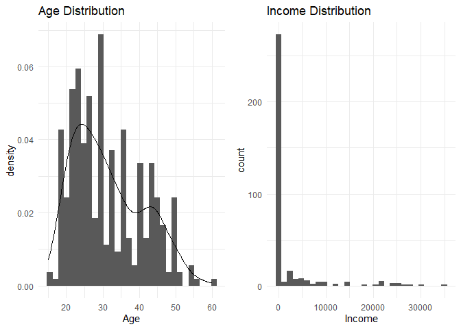
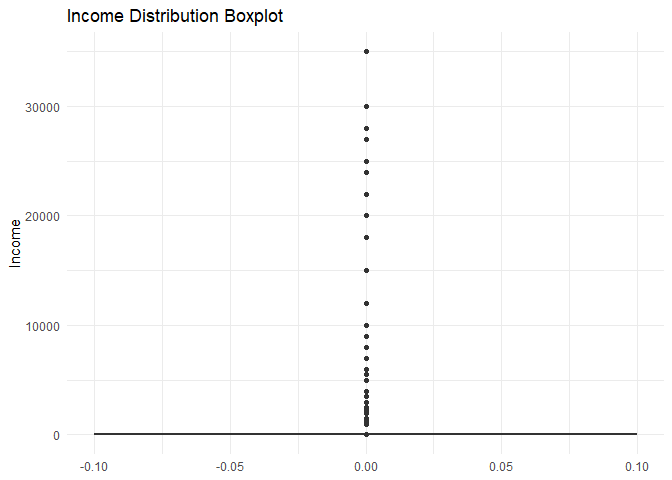
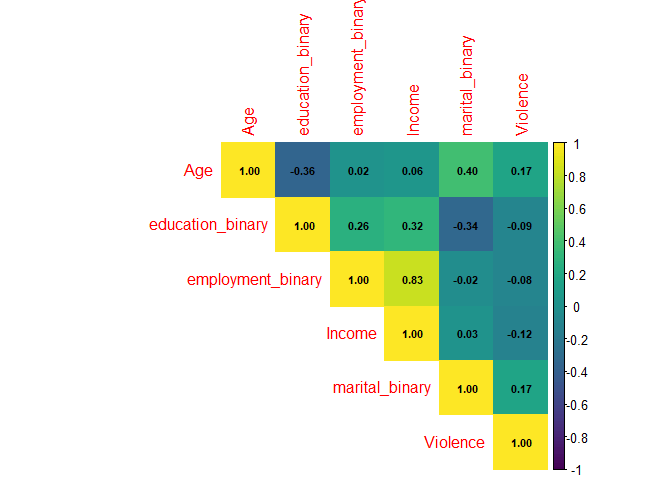
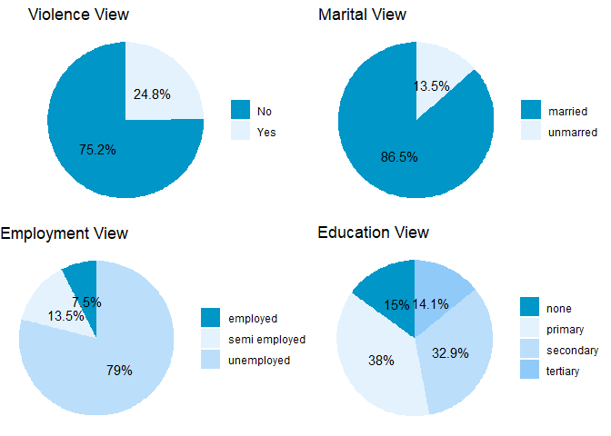
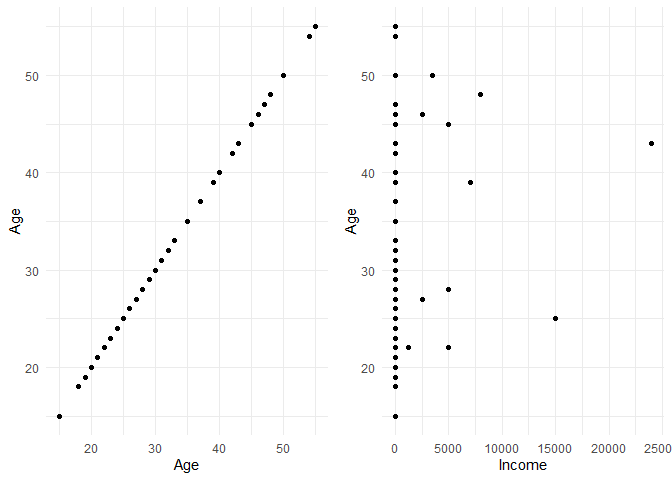
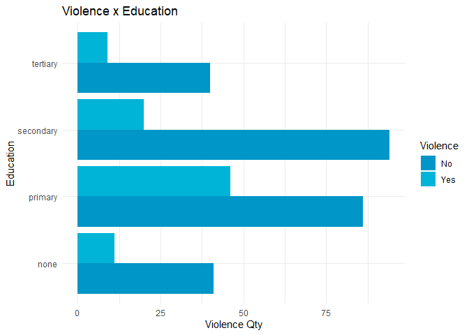
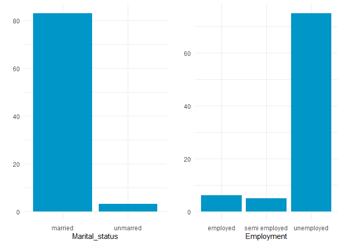
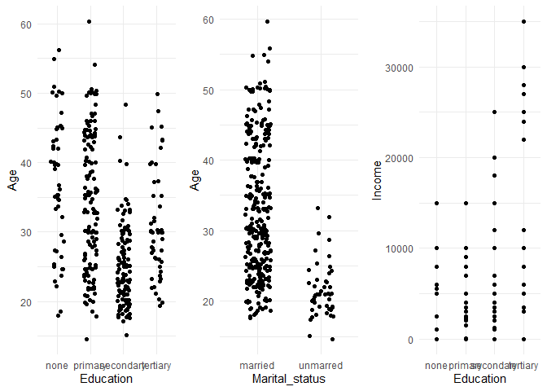
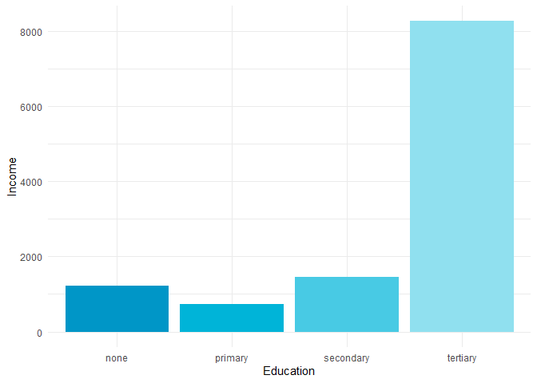
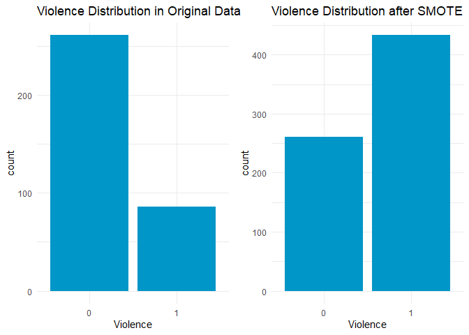

Abhijith R Upadhya
2025-08-24

# **Violence on Women - Analysis**

<figure>

<figcaption aria-hidden="true">Source: Media Licdn.</figcaption>
</figure>

## Introduction

In this analysis, we explore a dataset on domestic violence and examine
several variables to understand their distribution, relationships, and
potential predictive power for violence occurrence. Key variables
include Age, Income, Education, Employment, and Marital Status. The aim
is to preprocess the data, visualize patterns, and implement machine
learning models to predict occurrences of violence.

## Libraries

``` r
library(e1071)
library(rpart)
library(randomForest)
library(class)
library(ROSE)
library(caret)
library(gridExtra)
library(tidyr)
library(RColorBrewer)
library(tidyverse)
library(corrplot)
library(ggplot2)
library(viridis)
library(dplyr)
```

## Loading the dataset

``` r
# Read the dataset
df <- read.csv("Domestic_violence.csv")
```

## Data Transformation

### Data Preparation and Cleaning

Loading Packages and Dataset: Load necessary libraries for data
manipulation, visualization, and modeling. The dataset is read and
cleaned to prepare for analysis. Handling Missing Values and Duplicate
Records: Check for and handle null values, duplicates, and inconsistent
entries.

Feature Engineering: Binarize categorical variables like Marital_status,
Education, Employment, and Violence for better model compatibility.
Additionally, some columns are trimmed and converted to binary form
where applicable.

``` r
# Data preparation
df <- df %>% 
  select(-'Sl.No.') %>%
  mutate(across(c('Education', 'Employment', 'Marital_status'), as.character)) %>%
  mutate(Employment = trimws(Employment))

# Check dimensions
dim(df)
```

    ## [1] 347   6

``` r
# Check data types
str(df)
```

    ## 'data.frame':    347 obs. of  6 variables:
    ##  $ Age           : int  30 47 24 22 50 21 30 27 20 18 ...
    ##  $ Education     : chr  "secondary" "tertiary" "tertiary" "tertiary" ...
    ##  $ Employment    : chr  "unemployed" "unemployed" "unemployed" "unemployed" ...
    ##  $ Income        : int  0 0 0 0 0 0 0 0 0 0 ...
    ##  $ Marital_status: chr  "married" "married" "unmarred" "unmarred" ...
    ##  $ Violence      : chr  "yes" "no" "no" "no" ...

``` r
# Check for null values
colSums(is.na(df))
```

    ##            Age      Education     Employment         Income Marital_status 
    ##              0              0              0              0              0 
    ##       Violence 
    ##              0

``` r
# Count distinct values for each column
sapply(df, function(x) length(unique(x)))
```

    ##            Age      Education     Employment         Income Marital_status 
    ##             39              4              3             29              2 
    ##       Violence 
    ##              2

``` r
# Binarize the dataset
df <- df %>%
  mutate(
    marital_binary = case_when(
      Marital_status == 'married' ~ 1,
      Marital_status == 'unmarred' ~ 0
    ),
    Violence = case_when(
      Violence == 'yes' ~ 1,
      Violence == 'no' ~ 0
    ),
    education_binary = case_when(
      Education == 'none' ~ 0,
      Education == 'primary' ~ 1,
      Education == 'secondary' ~ 2,
      Education == 'tertiary' ~ 3
    ),
    employment_binary = case_when(
      Employment == 'unemployed' ~ 0,
      Employment == 'semi employed' ~ 1,
      Employment == 'employed' ~ 2
    )
  )

# Check zero income count
sum(df$Income == 0)
```

    ## [1] 272

``` r
# Check outliers - Employed/Semi-employed with zero income
mask <- df %>%
  filter(Income == 0 & (Employment == "employed" | Employment == "semi employed"))
print(mask)
```

    ## [1] Age               Education         Employment        Income           
    ## [5] Marital_status    Violence          marital_binary    education_binary 
    ## [9] employment_binary
    ## <0 rows> (or 0-length row.names)

``` r
# Check duplicates
duplicate_rows <- df[duplicated(df), ]
cat("Number of duplicate rows:", nrow(duplicate_rows))
```

    ## Number of duplicate rows: 133

``` r
# Summary statistics
summary(df)
```

    ##       Age         Education          Employment            Income     
    ##  Min.   :15.00   Length:347         Length:347         Min.   :    0  
    ##  1st Qu.:23.00   Class :character   Class :character   1st Qu.:    0  
    ##  Median :30.00   Mode  :character   Mode  :character   Median :    0  
    ##  Mean   :31.38                                         Mean   : 2111  
    ##  3rd Qu.:39.50                                         3rd Qu.:    0  
    ##  Max.   :60.00                                         Max.   :35000  
    ##  Marital_status        Violence      marital_binary   education_binary
    ##  Length:347         Min.   :0.0000   Min.   :0.0000   Min.   :0.000   
    ##  Class :character   1st Qu.:0.0000   1st Qu.:1.0000   1st Qu.:1.000   
    ##  Mode  :character   Median :0.0000   Median :1.0000   Median :1.000   
    ##                     Mean   :0.2478   Mean   :0.8646   Mean   :1.461   
    ##                     3rd Qu.:0.0000   3rd Qu.:1.0000   3rd Qu.:2.000   
    ##                     Max.   :1.0000   Max.   :1.0000   Max.   :3.000   
    ##  employment_binary
    ##  Min.   :0.0000   
    ##  1st Qu.:0.0000   
    ##  Median :0.0000   
    ##  Mean   :0.2853   
    ##  3rd Qu.:0.0000   
    ##  Max.   :2.0000

## Data Visualisation and Analysis

### 1. Histograms and Density Plots:

Age Distribution: Examines the age distribution within the dataset.

``` r
# Create histograms
par(mfrow = c(1, 2))
hist_age <- ggplot(df, aes(x = Age)) +
  geom_histogram(aes(y = after_stat(density)), bins = 30) +
  geom_density() +
  theme_minimal() +
  labs(title = "Age Distribution")
```

Income Distribution: Analyzes the income distribution with a focus on
zero-income cases.

``` r
hist_income <- ggplot(df, aes(x = Income)) +
  geom_histogram(bins = 30) +
  theme_minimal() +
  labs(title = "Income Distribution")

grid.arrange(hist_age, hist_income, ncol = 2)
```

<!-- -->

### 2. Boxplot of Income:

A boxplot reveals the spread and presence of any potential outliers
within the income data.

``` r
# Create boxplot
ggplot(df, aes(y = Income)) +
  geom_boxplot(width = 0.2) +
  theme_minimal() +
  labs(title = "Income Distribution Boxplot")
```

<!-- -->

### 3. Correlation Between Features

A correlation matrix visualizes relationships among features. Insights
from this plot help guide the selection of features for machine learning
models.

``` r
# Correlation matrix
df_binary <- df %>%
  select(Age, education_binary, employment_binary, Income, marital_binary, Violence)

correlation_matrix <- cor(df_binary)
corrplot(correlation_matrix, 
         method = "color", 
         type = "upper", 
         addCoef.col = "black",
         number.cex = 0.7,
         col = viridis(100))
```

<!-- -->

``` r
# Define color palettes
palette <- c("#0096c7", "#00b4d8", "#48cae4", "#90e0ef")
palette_pie <- c("#0096c7", "#e3f2fd", "#bbdefb", "#90caf9")
```

### 4. Relevant Pie Charts:

Violence Distribution: Displays the percentage distribution of reported
domestic violence cases.

Marital Status, Employment, and Education: These charts provide a visual
overview of the dataset’s composition in terms of marital status,
employment, and education levels.

``` r
# Display first 10 rows
head(df, 10)
```

    ##    Age Education Employment Income Marital_status Violence marital_binary
    ## 1   30 secondary unemployed      0        married        1              1
    ## 2   47  tertiary unemployed      0        married        0              1
    ## 3   24  tertiary unemployed      0       unmarred        0              0
    ## 4   22  tertiary unemployed      0       unmarred        0              0
    ## 5   50   primary unemployed      0        married        1              1
    ## 6   21  tertiary unemployed      0       unmarred        1              0
    ## 7   30  tertiary unemployed      0        married        0              1
    ## 8   27  tertiary unemployed      0        married        0              1
    ## 9   20  tertiary unemployed      0       unmarred        0              0
    ## 10  18 secondary unemployed      0        married        0              1
    ##    education_binary employment_binary
    ## 1                 2                 0
    ## 2                 3                 0
    ## 3                 3                 0
    ## 4                 3                 0
    ## 5                 1                 0
    ## 6                 3                 0
    ## 7                 3                 0
    ## 8                 3                 0
    ## 9                 3                 0
    ## 10                2                 0

``` r
# Distribution of features - Create 4 pie charts
# Violence View
p1 <- df %>%
  count(Violence) %>%
  mutate(
    prop = n/sum(n),
    label = c("No", "Yes"),
    pct = paste0(round(prop * 100, 1), "%")
  ) %>%
  ggplot(aes(x = "", y = prop, fill = factor(label))) +
  geom_bar(stat = "identity", width = 1) +
  coord_polar("y", start = 0) +
  geom_text(aes(label = pct), position = position_stack(vjust = 0.5)) +
  scale_fill_manual(values = palette_pie) +
  labs(title = "Violence View") +
  theme_void() +
  theme(legend.title = element_blank())

# Marital View
p2 <- df %>%
  count(Marital_status) %>%
  mutate(
    prop = n/sum(n),
    pct = paste0(round(prop * 100, 1), "%")
  ) %>%
  ggplot(aes(x = "", y = prop, fill = Marital_status)) +
  geom_bar(stat = "identity", width = 1) +
  coord_polar("y", start = 0) +
  geom_text(aes(label = pct), position = position_stack(vjust = 0.5)) +
  scale_fill_manual(values = palette_pie) +
  labs(title = "Marital View") +
  theme_void() +
  theme(legend.title = element_blank())

# Employment View
p3 <- df %>%
  count(Employment) %>%
  mutate(
    prop = n/sum(n),
    pct = paste0(round(prop * 100, 1), "%")
  ) %>%
  ggplot(aes(x = "", y = prop, fill = Employment)) +
  geom_bar(stat = "identity", width = 1) +
  coord_polar("y", start = 0) +
  geom_text(aes(label = pct), position = position_stack(vjust = 0.5)) +
  scale_fill_manual(values = palette_pie) +
  labs(title = "Employment View") +
  theme_void() +
  theme(legend.title = element_blank())

# Education View
p4 <- df %>%
  count(Education) %>%
  mutate(
    prop = n/sum(n),
    pct = paste0(round(prop * 100, 1), "%")
  ) %>%
  ggplot(aes(x = "", y = prop, fill = Education)) +
  geom_bar(stat = "identity", width = 1) +
  coord_polar("y", start = 0) +
  geom_text(aes(label = pct), position = position_stack(vjust = 0.5)) +
  scale_fill_manual(values = palette_pie) +
  labs(title = "Education View") +
  theme_void() +
  theme(legend.title = element_blank())

# Arrange all pie charts in a grid
grid.arrange(p1, p2, p3, p4, ncol = 2)
```

<!-- -->

### Scatter plots of Age and Income for violence cases highlight potential patterns.

``` r
# Age & Income x Violence
violence_data <- df %>% filter(Violence == 1)

# Create scatter plots for Age and Income
p5 <- ggplot(violence_data, aes(x = Age, y = Age)) +
  geom_point() +
  theme_minimal()

p6 <- ggplot(violence_data, aes(x = Income, y = Age)) +
  geom_point() +
  theme_minimal()

grid.arrange(p5, p6, ncol = 2)
```

<!-- -->

### Education and Violence Bar Plot: Demonstrates the relationship between education levels and violence incidence.

``` r
# Education x Violence
ggplot(df, aes(y = Education, fill = factor(Violence))) +
  geom_bar(position = "dodge") +
  scale_fill_manual(values = palette, labels = c("No", "Yes")) +
  labs(title = "Violence x Education", x = "Violence Qty", fill = "Violence") +
  theme_minimal()
```

<!-- -->

### Marital Status and Employment for Violence cases

``` r
# Marital Status and Employment for Violence cases
violence_plots <- df %>%
  filter(Violence == 1) %>%
  {
    list(
      ggplot(., aes(x = Marital_status)) +
        geom_bar(fill = palette[1]) +
        theme_minimal() +
        labs(y = ""),
      
      ggplot(., aes(x = Employment)) +
        geom_bar(fill = palette[1]) +
        theme_minimal() +
        labs(y = "")
    )
  }

grid.arrange(grobs = violence_plots, ncol = 2)
```

<!-- -->

### Relationships of Education, Age, Marital Status, and Income with one another

``` r
# Education x Age, Marital Status x Age, Education x Income
p7 <- ggplot(df, aes(x = Education, y = Age)) +
  geom_jitter(width = 0.2) +
  theme_minimal()

p8 <- ggplot(df, aes(x = Marital_status, y = Age)) +
  geom_jitter(width = 0.2) +
  theme_minimal()

p9 <- ggplot(df, aes(x = Education, y = Income)) +
  geom_point() +
  theme_minimal()

grid.arrange(p7, p8, p9, ncol = 3)
```

<!-- -->

### Average Income per Education Level

``` r
# Average income per Education Level
average_income_per_education <- df %>%
  group_by(Education) %>%
  summarise(Income = round(mean(Income), 2)) %>%
  arrange(Income)

print(average_income_per_education)
```

    ## # A tibble: 4 × 2
    ##   Education Income
    ##   <chr>      <dbl>
    ## 1 primary     736.
    ## 2 none       1221.
    ## 3 secondary  1458.
    ## 4 tertiary   8276.

``` r
ggplot(average_income_per_education, aes(x = Education, y = Income, fill = Education)) +
  geom_bar(stat = "identity") +
  scale_fill_manual(values = palette) +
  theme_minimal() +
  theme(legend.position = "none")
```

<!-- -->

### Binarizing the dataset and creating dummy variables for categorical features

``` r
# Binarizing the dataset
binary_features <- df %>% select(Age, Income, Violence)

# Creating dummy variables for the categorical features
# Excluding the already binarized columns
dummie_features <- df %>% 
  select(-Age, -Income, -Violence, -marital_binary, -education_binary, -employment_binary) %>%
  mutate(across(everything(), ~ ifelse(. == TRUE, 1, 0)))  # Transform TRUE/FALSE into 1/0

# Combining binary features with dummy features
df_ml <- cbind(binary_features, dummie_features)

# Plot original dataset Violence distribution
p1 <- ggplot(df_ml, aes(x = as.factor(Violence))) +
  geom_bar(fill = palette[1]) +
  labs(title = "Violence Distribution in Original Data", x = "Violence") +
  theme_minimal()
```

## Data Resampling

To address class imbalance in the violence variable, the SMOTE
(Synthetic Minority Over-sampling Technique) technique is used. This
resampling method balances the dataset by generating synthetic instances
of the minority class (violence cases).

``` r
# Re-sampling the dataset using SMOTE
set.seed(123)  # Set seed for reproducibility
table(df_ml$Violence)
```

    ## 
    ##   0   1 
    ## 261  86

``` r
# Set N to be larger than the total number of rows in the dataset
total_samples <- nrow(df_ml)
N_target <- 2 * total_samples  # Set to twice the total number of rows to ensure oversampling

# Apply SMOTE using the larger N value
smote_data <- ovun.sample(Violence ~ ., data = df_ml, method = "over", N = N_target)$data

# Plot resampled dataset Violence distribution
p2 <- ggplot(smote_data, aes(x = as.factor(Violence))) +
  geom_bar(fill = palette[1]) +
  labs(title = "Violence Distribution after SMOTE", x = "Violence") +
  theme_minimal()

# Arrange both plots side by side
grid.arrange(p1, p2, ncol = 2)
```

<!-- -->

``` r
# Randomly shuffle the resampled dataset
df_ml_sample <- smote_data[sample(nrow(smote_data)), ]

SEED <- 158020
set.seed(SEED)

# Prepare the dataset: Exclude the 'Violence' column from features (X) and define the target (y)
x <- df_ml_sample %>% select(-Violence)
y <- df_ml_sample$Violence

# Normalize the features using the preProcess function from the caret package
norm <- preProcess(x, method = c("center", "scale"))
x_norm <- predict(norm, x)
```

## Model Training and Evaluation

### Baseline and Predictive Models

``` r
# Split the data into training and testing sets
set.seed(123)
trainIndex <- createDataPartition(y, p = 0.7, list = FALSE)
train_x <- x_norm[trainIndex, ]
test_x <- x_norm[-trainIndex, ]
train_y <- y[trainIndex]
test_y <- y[-trainIndex]

# Function to run model scores
model <- function(model, test_x, test_y) {
  predictions <- predict(model, newdata = test_x)
  accuracy <- mean(predictions == test_y) * 100
  conf_matrix <- confusionMatrix(predictions, as.factor(test_y))
  
  print(conf_matrix)
  print(sprintf("Accuracy: %.2f%%", accuracy))
}
```

Baseline Random Forest: Establishes a benchmark for accuracy against
which other models are compared.

``` r
# Dummy Classifier - Baseline
dummy_model <- train(train_x, as.factor(train_y), method = "rf", trControl = trainControl(method = "cv", number = 5))
model(dummy_model, test_x, test_y)
```

    ## Confusion Matrix and Statistics
    ## 
    ##           Reference
    ## Prediction   0   1
    ##          0  32  17
    ##          1  49 110
    ##                                           
    ##                Accuracy : 0.6827          
    ##                  95% CI : (0.6148, 0.7453)
    ##     No Information Rate : 0.6106          
    ##     P-Value [Acc > NIR] : 0.0186548       
    ##                                           
    ##                   Kappa : 0.2813          
    ##                                           
    ##  Mcnemar's Test P-Value : 0.0001357       
    ##                                           
    ##             Sensitivity : 0.3951          
    ##             Specificity : 0.8661          
    ##          Pos Pred Value : 0.6531          
    ##          Neg Pred Value : 0.6918          
    ##              Prevalence : 0.3894          
    ##          Detection Rate : 0.1538          
    ##    Detection Prevalence : 0.2356          
    ##       Balanced Accuracy : 0.6306          
    ##                                           
    ##        'Positive' Class : 0               
    ##                                           
    ## [1] "Accuracy: 68.27%"

Naive Bayes Classifier: A simple probabilistic classifier based on
Bayes’ theorem.

``` r
# Naive Bayes Classifier
nb_model <- naiveBayes(as.factor(train_y) ~ ., data = train_x)
model(nb_model, test_x, test_y)
```

    ## Confusion Matrix and Statistics
    ## 
    ##           Reference
    ## Prediction   0   1
    ##          0   7   2
    ##          1  74 125
    ##                                           
    ##                Accuracy : 0.6346          
    ##                  95% CI : (0.5652, 0.7001)
    ##     No Information Rate : 0.6106          
    ##     P-Value [Acc > NIR] : 0.2622          
    ##                                           
    ##                   Kappa : 0.0842          
    ##                                           
    ##  Mcnemar's Test P-Value : 3.816e-16       
    ##                                           
    ##             Sensitivity : 0.08642         
    ##             Specificity : 0.98425         
    ##          Pos Pred Value : 0.77778         
    ##          Neg Pred Value : 0.62814         
    ##              Prevalence : 0.38942         
    ##          Detection Rate : 0.03365         
    ##    Detection Prevalence : 0.04327         
    ##       Balanced Accuracy : 0.53534         
    ##                                           
    ##        'Positive' Class : 0               
    ##                                           
    ## [1] "Accuracy: 63.46%"

Decision Tree: Provides interpretable results to identify key features
influencing violence.

``` r
# Decision Tree Classifier
tree_model <- rpart(as.factor(train_y) ~ ., data = train_x, method = "class", control = rpart.control(maxdepth = 2))

# Updated model function to ensure class predictions for decision trees
model <- function(model, test_x, test_y) {
  if ("rpart" %in% class(model)) {
    # For rpart models, get class predictions directly
    predictions <- predict(model, newdata = test_x, type = "class")
  } else {
    # For other models, assume normal predict works fine
    predictions <- predict(model, newdata = test_x)
  }
  
  accuracy <- mean(predictions == test_y) * 100
  conf_matrix <- confusionMatrix(predictions, as.factor(test_y))
  
  print(conf_matrix)
  print(sprintf("Accuracy: %.2f%%", accuracy))
}

# Run the model evaluation again for Decision Tree
model(tree_model, test_x, test_y)
```

    ## Confusion Matrix and Statistics
    ## 
    ##           Reference
    ## Prediction   0   1
    ##          0  13  21
    ##          1  68 106
    ##                                           
    ##                Accuracy : 0.5721          
    ##                  95% CI : (0.5018, 0.6403)
    ##     No Information Rate : 0.6106          
    ##     P-Value [Acc > NIR] : 0.8862          
    ##                                           
    ##                   Kappa : -0.0054         
    ##                                           
    ##  Mcnemar's Test P-Value : 1.083e-06       
    ##                                           
    ##             Sensitivity : 0.1605          
    ##             Specificity : 0.8346          
    ##          Pos Pred Value : 0.3824          
    ##          Neg Pred Value : 0.6092          
    ##              Prevalence : 0.3894          
    ##          Detection Rate : 0.0625          
    ##    Detection Prevalence : 0.1635          
    ##       Balanced Accuracy : 0.4976          
    ##                                           
    ##        'Positive' Class : 0               
    ##                                           
    ## [1] "Accuracy: 57.21%"

K-Nearest Neighbors (KNN): Applied with both Euclidean and Hamming
distances.

``` r
# K-Nearest Neighbors (KNN)
# With Euclidean distance
knn_model_euclidean <- knn(train = train_x, test = test_x, cl = train_y, k = 5)
confusionMatrix(knn_model_euclidean, as.factor(test_y))
```

    ## Confusion Matrix and Statistics
    ## 
    ##           Reference
    ## Prediction   0   1
    ##          0  17  20
    ##          1  64 107
    ##                                           
    ##                Accuracy : 0.5962          
    ##                  95% CI : (0.5261, 0.6634)
    ##     No Information Rate : 0.6106          
    ##     P-Value [Acc > NIR] : 0.692           
    ##                                           
    ##                   Kappa : 0.0581          
    ##                                           
    ##  Mcnemar's Test P-Value : 2.71e-06        
    ##                                           
    ##             Sensitivity : 0.20988         
    ##             Specificity : 0.84252         
    ##          Pos Pred Value : 0.45946         
    ##          Neg Pred Value : 0.62573         
    ##              Prevalence : 0.38942         
    ##          Detection Rate : 0.08173         
    ##    Detection Prevalence : 0.17788         
    ##       Balanced Accuracy : 0.52620         
    ##                                           
    ##        'Positive' Class : 0               
    ## 

``` r
# With Hamming distance (more suitable for binary data)
knn_model_hamming <- knn(train = train_x, test = test_x, cl = train_y, k = 4)
confusionMatrix(knn_model_hamming, as.factor(test_y))
```

    ## Confusion Matrix and Statistics
    ## 
    ##           Reference
    ## Prediction   0   1
    ##          0  19  20
    ##          1  62 107
    ##                                           
    ##                Accuracy : 0.6058          
    ##                  95% CI : (0.5358, 0.6726)
    ##     No Information Rate : 0.6106          
    ##     P-Value [Acc > NIR] : 0.5864          
    ##                                           
    ##                   Kappa : 0.0851          
    ##                                           
    ##  Mcnemar's Test P-Value : 5.963e-06       
    ##                                           
    ##             Sensitivity : 0.23457         
    ##             Specificity : 0.84252         
    ##          Pos Pred Value : 0.48718         
    ##          Neg Pred Value : 0.63314         
    ##              Prevalence : 0.38942         
    ##          Detection Rate : 0.09135         
    ##    Detection Prevalence : 0.18750         
    ##       Balanced Accuracy : 0.53854         
    ##                                           
    ##        'Positive' Class : 0               
    ## 

Random Forest: Offers higher accuracy by averaging multiple decision
trees.

``` r
# Random Forest Classifier
rf_model <- randomForest(as.factor(train_y) ~ ., data = train_x, ntree = 100)
model(rf_model, test_x, test_y)
```

    ## Confusion Matrix and Statistics
    ## 
    ##           Reference
    ## Prediction   0   1
    ##          0  11  10
    ##          1  70 117
    ##                                           
    ##                Accuracy : 0.6154          
    ##                  95% CI : (0.5456, 0.6818)
    ##     No Information Rate : 0.6106          
    ##     P-Value [Acc > NIR] : 0.4738          
    ##                                           
    ##                   Kappa : 0.0659          
    ##                                           
    ##  Mcnemar's Test P-Value : 4.213e-11       
    ##                                           
    ##             Sensitivity : 0.13580         
    ##             Specificity : 0.92126         
    ##          Pos Pred Value : 0.52381         
    ##          Neg Pred Value : 0.62567         
    ##              Prevalence : 0.38942         
    ##          Detection Rate : 0.05288         
    ##    Detection Prevalence : 0.10096         
    ##       Balanced Accuracy : 0.52853         
    ##                                           
    ##        'Positive' Class : 0               
    ##                                           
    ## [1] "Accuracy: 61.54%"

``` r
# Define a function to print results
print_results <- function(results) {
  mean_acc <- mean(results$results$Accuracy)
  std_acc <- sd(results$results$Accuracy)
  cat(sprintf("Average Accuracy: %.2f%%\n", mean_acc * 100))
  cat(sprintf("Accuracy interval: [%.2f, %.2f]%%\n", (mean_acc - 2 * std_acc) * 100, (mean_acc + 2 * std_acc) * 100))
}
```

### Model Performance Evaluation

Confusion Matrix and Accuracy: Each model’s performance is evaluated
using accuracy and confusion matrix metrics to assess the classification
quality.

Cross-Validation: All models undergo cross-validation to provide robust
performance metrics and avoid overfitting.

``` r
# Set random seed
set.seed(158020)

# Define cross-validation method
train_control <- trainControl(method = "cv", number = 10)

# Prepare the dataset (x and y are from previous steps, assuming they are ready)
# x_norm and y are normalized features and target (Violence) from the previous steps

# Ensure y is named properly and combine with x_norm
df_combined <- cbind(x_norm, Violence = y)  # Rename your target variable appropriately

# Check column names of df_combined to ensure there's no mismatch
colnames(df_combined)
```

    ## [1] "Age"            "Income"         "Education"      "Employment"    
    ## [5] "Marital_status" "Violence"

``` r
# Decision Tree Classifier with cross-validation
tree_model <- train(as.factor(Violence) ~ ., data = df_combined, 
                    method = "rpart", 
                    trControl = train_control, 
                    tuneGrid = expand.grid(cp = 0.01),  # Cross-validation on complexity parameter
                    control = rpart.control(maxdepth = 2))

# Check the results
tree_model
```

    ## CART 
    ## 
    ## 694 samples
    ##   5 predictor
    ##   2 classes: '0', '1' 
    ## 
    ## No pre-processing
    ## Resampling: Cross-Validated (10 fold) 
    ## Summary of sample sizes: 625, 625, 625, 624, 625, 625, ... 
    ## Resampling results:
    ## 
    ##   Accuracy   Kappa     
    ##   0.6310766  0.07216199
    ## 
    ## Tuning parameter 'cp' was held constant at a value of 0.01

``` r
# Print cross-validation results for Decision Tree
print_results(tree_model)
```

    ## Average Accuracy: 63.11%
    ## Accuracy interval: [NA, NA]%

``` r
# K-Nearest Neighbors with cross-validation
knn_model <- train(as.factor(Violence) ~ ., data = df_combined, 
                   method = "knn", 
                   metric = "Accuracy", 
                   tuneGrid = expand.grid(k = 3),  # 3 neighbors
                   trControl = train_control)

# Print cross-validation results for KNN
print_results(knn_model)
```

    ## Average Accuracy: 69.62%
    ## Accuracy interval: [NA, NA]%

``` r
# Random Forest with cross-validation
rf_model <- train(as.factor(Violence) ~ ., data = df_combined, 
                  method = "rf", 
                  trControl = train_control, 
                  tuneGrid = expand.grid(mtry = 3))  # mtry can be adjusted or optimized

# Print cross-validation results for Random Forest
print_results(rf_model)
```

    ## Average Accuracy: 68.01%
    ## Accuracy interval: [NA, NA]%

### Hyperparameter Tuning

Grid Search for KNN and Random Forest: An optimal number of neighbors
(k) for KNN and best ‘mtry’ values for Random Forest are identified
using grid search, maximizing accuracy.

``` r
# Grid Search for KNN (search for optimal 'k')
knn_grid <- expand.grid(k = 1:31)  # Searching k from 1 to 31

knn_grid_search <- train(as.factor(Violence) ~ ., data = df_combined, 
                         method = "knn", 
                         trControl = trainControl(method = "cv", number = 10), 
                         tuneGrid = knn_grid)

# Make predictions using the best model from Grid Search
knn_predictions <- predict(knn_grid_search, newdata = test_x)

# Evaluate the KNN model
confusionMatrix(knn_predictions, as.factor(test_y))
```

    ## Confusion Matrix and Statistics
    ## 
    ##           Reference
    ## Prediction   0   1
    ##          0  42   9
    ##          1  39 118
    ##                                           
    ##                Accuracy : 0.7692          
    ##                  95% CI : (0.7059, 0.8247)
    ##     No Information Rate : 0.6106          
    ##     P-Value [Acc > NIR] : 8.690e-07       
    ##                                           
    ##                   Kappa : 0.4798          
    ##                                           
    ##  Mcnemar's Test P-Value : 2.842e-05       
    ##                                           
    ##             Sensitivity : 0.5185          
    ##             Specificity : 0.9291          
    ##          Pos Pred Value : 0.8235          
    ##          Neg Pred Value : 0.7516          
    ##              Prevalence : 0.3894          
    ##          Detection Rate : 0.2019          
    ##    Detection Prevalence : 0.2452          
    ##       Balanced Accuracy : 0.7238          
    ##                                           
    ##        'Positive' Class : 0               
    ## 

``` r
cat("Best number of neighbors:", knn_grid_search$bestTune$k, "\n")
```

    ## Best number of neighbors: 1

``` r
# Define the tuning grid for mtry (number of predictors randomly sampled at each split)
rf_grid <- expand.grid(mtry = c(1, 2, 3, 4, 5))  # Adjust values as needed

# Perform grid search with cross-validation for Random Forest
rf_grid_search <- train(as.factor(Violence) ~ ., data = df_combined, 
                        method = "rf", 
                        trControl = trainControl(method = "cv", number = 10), 
                        tuneGrid = rf_grid)  # Use the proper tuneGrid with mtry

# Check the results
rf_grid_search
```

    ## Random Forest 
    ## 
    ## 694 samples
    ##   5 predictor
    ##   2 classes: '0', '1' 
    ## 
    ## No pre-processing
    ## Resampling: Cross-Validated (10 fold) 
    ## Summary of sample sizes: 625, 625, 625, 625, 625, 624, ... 
    ## Resampling results across tuning parameters:
    ## 
    ##   mtry  Accuracy   Kappa     
    ##   1     0.6340580  0.04775053
    ##   2     0.6470393  0.08380190
    ##   3     0.6816563  0.19637691
    ##   4     0.7348447  0.36946612
    ##   5     0.7319876  0.37403343
    ## 
    ## Accuracy was used to select the optimal model using the largest value.
    ## The final value used for the model was mtry = 4.

``` r
# Make predictions using the best Random Forest model from Grid Search
rf_predictions <- predict(rf_grid_search, newdata = test_x)

# Evaluate the Random Forest model
confusionMatrix(rf_predictions, as.factor(test_y))
```

    ## Confusion Matrix and Statistics
    ## 
    ##           Reference
    ## Prediction   0   1
    ##          0  41   8
    ##          1  40 119
    ##                                           
    ##                Accuracy : 0.7692          
    ##                  95% CI : (0.7059, 0.8247)
    ##     No Information Rate : 0.6106          
    ##     P-Value [Acc > NIR] : 8.69e-07        
    ##                                           
    ##                   Kappa : 0.4773          
    ##                                           
    ##  Mcnemar's Test P-Value : 7.66e-06        
    ##                                           
    ##             Sensitivity : 0.5062          
    ##             Specificity : 0.9370          
    ##          Pos Pred Value : 0.8367          
    ##          Neg Pred Value : 0.7484          
    ##              Prevalence : 0.3894          
    ##          Detection Rate : 0.1971          
    ##    Detection Prevalence : 0.2356          
    ##       Balanced Accuracy : 0.7216          
    ##                                           
    ##        'Positive' Class : 0               
    ## 

## Results and Discussion

### Comparison of Models:

Accuracy metrics reveal that Random Forest consistently provides strong
performance, followed by the Decision Tree and Naive Bayes models.

### Interpretation of Findings:

Education level, employment status, and age appear to correlate with the
likelihood of violence cases. Employment status and marital status are
prominent indicators in the classification of violence cases.

## Conclusion

This analysis effectively identifies patterns associated with domestic
violence using multiple machine learning techniques. Random Forest and
Decision Tree classifiers offer high accuracy and are suitable for
interpreting feature importance. Our findings underscore the impact of
socioeconomic factors on violence prevalence, and these models can
assist in targeted interventions. Future work could expand on this
analysis by incorporating additional features and testing on larger
datasets for broader applicability.
